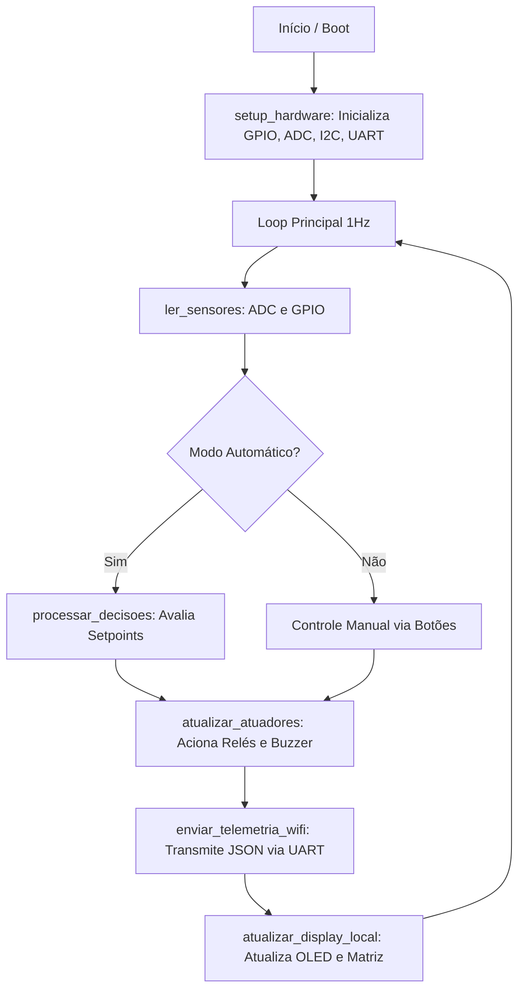

# Relatório Técnico: FarmTech - Domo Geodésico Autônomo para o Sertão

**Autor:** Luciano Morais  
**Curso:** Residência Tecnológica em Sistemas Embarcados  
**Instituição:** EmbarcaTech  
**Data:** Abril de 2026  
**Plataforma:** BitDogLab v3 (Raspberry Pi Pico W - RP2040)

---

## a. Apresentação

O projeto **FarmTech** consiste no desenvolvimento de um sistema embarcado autônomo de controle ambiental, projetado especificamente para otimizar o cultivo hidropônico em domos geodésicos no Sertão Brasileiro. 

A agricultura no semiárido nordestino enfrenta desafios climáticos severos, caracterizados pela escassez hídrica, altas temperaturas, baixa umidade relativa do ar e intensa radiação solar. O cultivo tradicional a céu aberto nessas condições frequentemente resulta em perda de safra e uso ineficiente dos limitados recursos hídricos disponíveis. 

Nesse contexto, o FarmTech propõe uma solução tecnológica baseada na criação de um microclima controlado dentro de uma estrutura geodésica. O sistema atua como a Unidade Central de Controle (UCC), monitorando continuamente as variáveis ambientais e tomando decisões autônomas para manter as condições ideais de cultivo. Ao proteger as plantas do clima extremo e otimizar o uso de água através da hidroponia de circuito fechado, o projeto visa garantir resiliência e eficiência na produção agrícola familiar e comercial na região.

## b. Objetivos

### Objetivo Geral
Desenvolver e implementar um sistema embarcado de baixo custo e alta eficiência para a automação de estufas hidropônicas no semiárido, utilizando a plataforma de desenvolvimento BitDogLab v3, baseada no microcontrolador RP2040.

### Objetivos Específicos
- Monitorar em tempo real variáveis ambientais críticas: temperatura, umidade, luminosidade e nível do reservatório de água.
- Controlar atuadores (sistemas de ventilação, nebulização, iluminação suplementar e bombas d'água) de forma autônoma, baseada em lógicas de controle e *setpoints* pré-definidos.
- Fornecer uma interface de diagnóstico local clara e responsiva através de um Display Gráfico OLED e uma Matriz de LEDs WS2812B.
- Transmitir dados de telemetria via comunicação serial (UART) formatados em JSON, preparando o sistema para integração IoT via Wi-Fi.
- Garantir a resiliência do sistema através da implementação de modos de *fallback* em caso de falha na leitura dos sensores principais.

## c. Requisitos Funcionais

Para atender aos objetivos propostos, o sistema foi projetado com os seguintes requisitos funcionais:
- **Aquisição de Dados Sensoriais**: O sistema deve realizar a leitura de dados analógicos (via ADC) e digitais a uma taxa de atualização de 1 Hz (1 segundo).
- **Controle Lógico Autônomo**: O microcontrolador deve acionar os relés correspondentes aos atuadores com base em regras lógicas que avaliam o clima e a necessidade de hidratação.
- **Alternância de Modos de Operação**: O sistema deve permitir a transição entre os modos "Automático" e "Manual" através de interrupções de hardware geradas por botões físicos (Botão A), com tratamento adequado de *debounce*.
- **Interface Visual de Status**: O status operacional e as leituras dos sensores devem ser exibidos continuamente no Display OLED (via I2C) e refletidos na Matriz de LEDs.
- **Sistema de Alertas Críticos**: Em condições ambientais extremas (Temperatura > 35°C ou Nível de Água < 5%), o sistema deve acionar um alarme sonoro (Buzzer) e sinalizar a criticidade na telemetria.
- **Comunicação de Telemetria**: Os dados coletados e o estado dos atuadores devem ser empacotados em formato JSON e transmitidos via interface UART.

## d. Arquitetura de Hardware

O hardware do projeto é centralizado na placa didática **BitDogLab v3**, que integra os componentes necessários para a simulação e controle do domo geodésico:

- **Microcontrolador Central**: Raspberry Pi Pico W (RP2040) - Processador dual-core ARM Cortex-M0+ operando a 133 MHz, responsável pelo processamento da lógica de controle e gerenciamento dos periféricos.
- **Sensores (Módulos de Entrada)**:
  - **Sensor de Temperatura e Umidade (DHT22 - GP4)**: Monitoramento digital do clima interno. *(Nota: Foi implementado um sistema de fallback utilizando os eixos X e Y do Joystick nos pinos ADC0 e ADC1 para simulação de dados em caso de falha do sensor físico)*.
  - **Sensor de Luminosidade (LDR - GP28 / ADC2)**: Leitura analógica da luz ambiente para controle da iluminação suplementar (fotossíntese).
  - **Sensor de Nível de Água (GP29 / ADC3)**: Monitoramento analógico do volume do reservatório de solução nutritiva.
  - **Botões de Controle (GP5 e GP6)**: Entradas digitais configuradas com resistores de *pull-up* internos para interação do usuário.
- **Atuadores e Interfaces (Módulos de Saída)**:
  - **Módulo de Relés (GP8 a GP12)**: Sinais de controle digital para acionamento de cargas de potência (Exaustor, Entrada de Ar, Nebulizador, Grow Lights e Bomba d'Água).
  - **Display Gráfico OLED (GP14/GP15 - I2C1)**: Interface visual local baseada no controlador SSD1306, operando via protocolo I2C.
  - **Matriz de LEDs Inteligentes (WS2812B - GP7)**: Matriz 5x5 controlada via máquina de estados PIO (Programmable I/O) para *feedback* visual rápido.
  - **Buzzer Passivo (GP13)**: Emissor de alertas sonoros.
- **Módulo de Comunicação**:
  - **Interface UART (GP0/GP1 - UART0)**: Configurada a 115200 bps para transmissão da telemetria JSON.

## e. Arquitetura do Firmware

O software embarcado foi desenvolvido inteiramente em linguagem **C/C++**, utilizando as bibliotecas padrão do **Raspberry Pi Pico SDK**. A arquitetura de software segue o padrão *Super Loop* (Loop Infinito) combinado com o uso de interrupções para eventos assíncronos. O código está modularizado nas seguintes etapas principais:

1. **Inicialização do Sistema (`setup_hardware`)**: Rotina executada no *boot*. Configura a direção dos pinos GPIO, inicializa os conversores analógico-digitais (ADC), configura o barramento I2C para o display, inicializa a máquina PIO para a matriz de LEDs e configura a porta UART.
2. **Aquisição de Dados (`ler_sensores`)**: Função chamada a cada iteração do loop. Realiza a leitura sequencial dos canais ADC e dos pinos digitais. Inclui a lógica de *debounce* em software para garantir a leitura limpa dos botões.
3. **Processamento Lógico (`processar_decisoes`)**: O núcleo de inteligência do sistema. Compara as leituras atuais dos sensores com os *setpoints* definidos (ex: `TEMP_MAX = 28.0°C`, `UMIDADE_MIN = 75%`) e determina o estado booleano futuro de cada atuador.
4. **Atuação Física (`atualizar_atuadores`)**: Aplica os estados lógicos calculados na etapa anterior aos pinos GPIO correspondentes aos relés, LEDs e Buzzer.
5. **Comunicação e Interface (`enviar_telemetria_wifi` e `atualizar_display_local`)**: Formata as variáveis de estado em uma *string* JSON utilizando `snprintf` e a transmite via `uart_puts`. Simultaneamente, atualiza o *buffer* de vídeo do display OLED via I2C.

## f. Fluxograma do Sistema

O diagrama abaixo ilustra o fluxo de execução principal do firmware embarcado:

## g. Indicação do uso de IA

Durante o desenvolvimento deste projeto, ferramentas de Inteligência Artificial (Manus AI / Google AntiGravity) foram utilizadas como assistentes de engenharia de software para as seguintes finalidades:
- Auxílio na estruturação inicial do código em C e na resolução de conflitos de roteamento de pinos (especificamente na realocação dos canais ADC da placa BitDogLab).
- Geração e formatação da documentação técnica (README.md e este Relatório Técnico) seguindo padrões acadêmicos.
- Revisão de boas práticas de programação aplicadas a sistemas embarcados utilizando o Pico SDK.
Ressalta-se que a lógica de controle central, a definição da arquitetura do sistema e a concepção do projeto FarmTech são de autoria própria, desenvolvidas para atender aos requisitos do programa EmbarcaTech.

## h. Conclusão

O projeto FarmTech demonstrou com êxito a viabilidade técnica da implementação de um sistema embarcado de baixo custo para o controle ambiental preciso em estufas hidropônicas. A utilização da plataforma BitDogLab v3, baseada no microcontrolador RP2040, provou ser robusta e adequada para o gerenciamento simultâneo de múltiplos sensores analógicos e digitais, bem como para o controle autônomo de atuadores de potência.

**Resultados Alcançados:**
- Leitura estável e confiável dos sensores, com atuação correta dos relés baseada na lógica de controle climático e hídrico.
- Interface local plenamente funcional, fornecendo *feedback* visual imediato através do Display OLED e da Matriz de LEDs.
- Geração e transmissão correta de telemetria em formato JSON via UART, validando a prontidão do sistema para integração IoT.

**Dificuldades Enfrentadas:**
- O principal desafio técnico envolveu conflitos de pinagem do ADC na placa BitDogLab, que foram solucionados através da realocação estratégica dos pinos (GP28 e GP29) para os sensores LDR e de Nível de Água.
- A necessidade de garantir a continuidade dos testes na ausência de sensores físicos específicos levou à implementação bem-sucedida de um sistema de *fallback*, utilizando o Joystick da placa para simular variações de temperatura e umidade.

**Melhorias Futuras:**
- Integração completa do módulo Wi-Fi (CYW43439) nativo da placa Pico W para o envio direto de dados via protocolo MQTT para um *broker* na nuvem.
- Desenvolvimento de um *dashboard* web ou aplicativo mobile para a visualização remota da telemetria e controle manual à distância.
- Adição de sensores de pH e Condutividade Elétrica (EC) para permitir o controle automatizado e preciso da dosagem da solução nutritiva na hidroponia.
