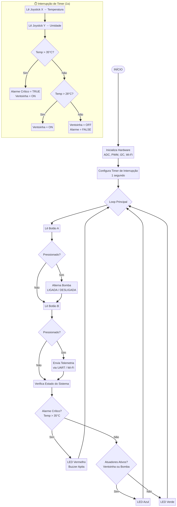

# Relatório Técnico - Projeto Final EmbarcaTech
**Projeto:** FarmTech - Sistema de Controle para Domo Geodésico Hidropônico
**Autor:** Luciano R. Morais

---

## a. Apresentação
O projeto **FarmTech** propõe um sistema de controle automatizado para um domo geodésico hidropônico voltado para a região do sertão brasileiro. O desafio abordado é a dificuldade de manter um ambiente termicamente estável e com umidade adequada para o cultivo de plantas em regiões de clima semiárido extremo. A motivação para o desenvolvimento desta solução é criar um "bunker agrícola" de baixo custo, utilizando a placa BitDogLab (RP2040) para monitorar e atuar sobre o microclima interno, garantindo a sobrevivência e o crescimento das plantas com o mínimo de intervenção humana.

## b. Objetivos
**Objetivo Geral:**
Desenvolver um firmware em C/C++ para a placa BitDogLab capaz de monitorar variáveis climáticas e controlar atuadores para manter o microclima de um domo hidropônico.

**Objetivos Específicos:**
- Ler dados de temperatura e umidade (simulados via ADC no joystick).
- Controlar atuadores (bomba d'água e ventoinha) de forma automática e manual.
- Fornecer feedback visual e sonoro sobre o estado do sistema (LED RGB e Buzzer).
- Enviar dados de telemetria via Wi-Fi/UART para monitoramento remoto.
- Utilizar interrupções de hardware para garantir a leitura contínua dos sensores sem bloquear a execução principal.

## c. Requisitos Funcionais
1. **Monitoramento Contínuo:** O sistema deve ler a temperatura (15°C a 45°C) e umidade (30% a 90%) a cada 1 segundo.
2. **Controle Automático de Clima:** Se a temperatura ultrapassar 28°C, a ventoinha deve ser ligada. Se ultrapassar 35°C, um alarme crítico deve ser acionado.
3. **Controle Manual:** O usuário deve poder ligar/desligar a bomba d'água pressionando o Botão A.
4. **Telemetria:** O usuário deve poder forçar o envio de um pacote JSON com os dados atuais pressionando o Botão B.
5. **Feedback Visual:** O LED RGB deve indicar o status: Verde (Normal), Azul (Atuadores ligados), Vermelho (Alarme Crítico).
6. **Feedback Sonoro:** O Buzzer deve emitir bipes curtos durante o estado de alarme crítico.

## d. Arquitetura de Hardware
O sistema embarcado é composto pela placa **BitDogLab**, baseada no microcontrolador Raspberry Pi Pico W (RP2040). Os componentes utilizados são:
- **Microcontrolador (RP2040):** Cérebro do sistema, responsável pelo processamento lógico.
- **Módulo Wi-Fi (CYW43439):** Integrado ao Pico W, utilizado para habilitar a comunicação de rede.
- **Joystick Analógico (Eixos X e Y):** Conectados aos pinos ADC0 (GP26) e ADC1 (GP27), utilizados para simular a variação de temperatura e umidade do ambiente.
- **Botões Push-button (A e B):** Conectados aos pinos GP5 e GP6 com pull-up interno, utilizados para controle manual da bomba e envio de telemetria.
- **LED RGB:** Conectado aos pinos GP11, GP12 e GP13, controlado via PWM para indicar o status do sistema.
- **Buzzer:** Conectado ao pino GP21, controlado via PWM para emitir alertas sonoros.
- **Display OLED (I2C):** Conectado aos pinos GP14 e GP15, disponível para expansão de interface visual local.

## e. Arquitetura do Firmware
O firmware foi desenvolvido em linguagem C utilizando o Pico SDK. A estrutura lógica é dividida em três blocos principais:
1. **Inicialização:** Configuração dos periféricos (ADC, PWM, GPIO, I2C, Wi-Fi) e do temporizador de repetição.
2. **Interrupção de Tempo (Timer Callback):** Uma função de callback (`sensor_timer_callback`) é executada a cada 1000 ms. Ela lê os valores do ADC (simulando os sensores), atualiza as variáveis globais de temperatura e umidade, e executa a lógica de controle automático (ligar ventoinha ou acionar alarme).
3. **Loop Principal (Super Loop):** O loop `while(true)` é responsável por ler os botões com debounce por software, enviar os dados via UART/Wi-Fi e atualizar os atuadores de feedback (LED RGB e Buzzer) com base nas variáveis de estado modificadas pela interrupção.

Essa separação garante que a leitura dos sensores ocorra de forma determinística, independentemente de atrasos no loop principal.

## f. Fluxograma
O fluxograma abaixo representa o funcionamento do sistema, destacando a separação entre o loop principal e a rotina de interrupção.

## g. Indicação do uso de IA
Ferramentas de Inteligência Artificial (Manus AI) foram utilizadas como assistentes de desenvolvimento durante a elaboração deste projeto. A IA auxiliou na:
- Estruturação do código C, garantindo o uso correto das bibliotecas do Pico SDK (hardware/adc, hardware/pwm, hardware/timer).
- Geração do fluxograma em formato Mermaid para representação visual da arquitetura de software.
- Revisão e formatação deste relatório técnico para garantir clareza e adequação aos requisitos exigidos no guia do projeto final.

## h. Conclusão
O projeto FarmTech demonstrou com sucesso a aplicação prática dos conceitos de Sistemas Embarcados utilizando a placa BitDogLab. A integração de periféricos variados (ADC, PWM, GPIO, Timer Interrupts e Wi-Fi) provou a versatilidade do microcontrolador RP2040. 
A principal dificuldade enfrentada foi o gerenciamento de conflitos de hardware, como o compartilhamento de slices PWM entre os pinos do LED RGB, que exigiu ajustes na configuração de frequência. 
Como melhorias futuras, propõe-se a substituição do joystick por sensores reais (DHT22 e sensores de nível de água), a implementação de um dashboard web via servidor HTTP embarcado no Pico W, e a integração com um broker MQTT para armazenamento de dados em nuvem.
